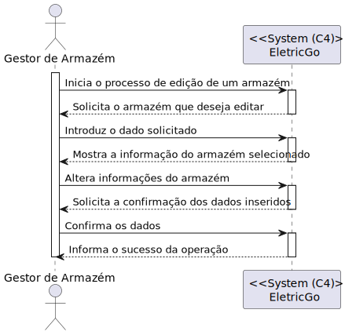
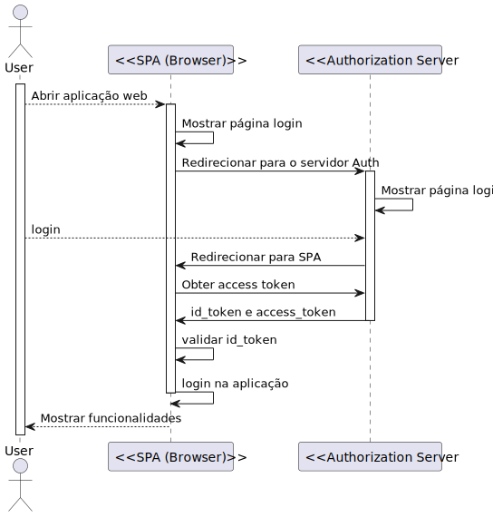
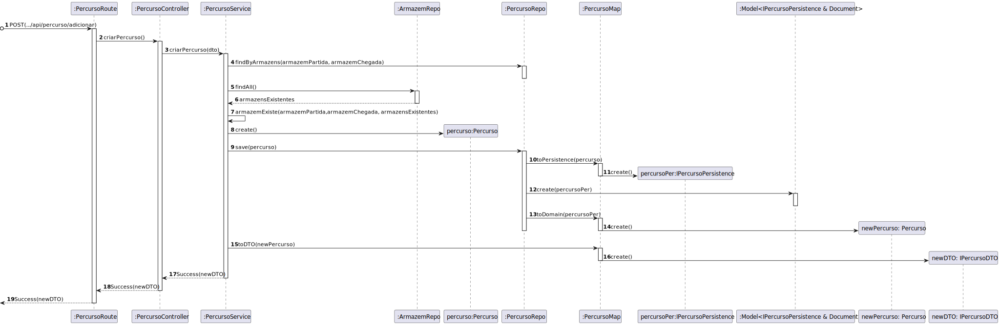
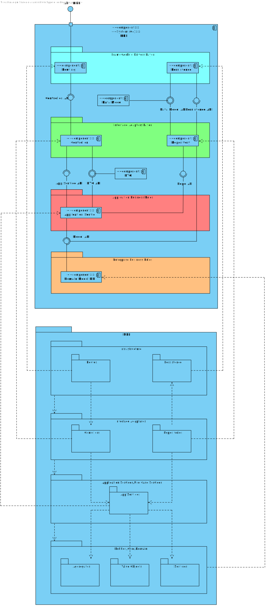

# Modelo de Domínio

# Vistas

## Nível 1

### Vista Lógica

### Vista de Processos

#### SSD US1 - Como gestor de armazém, pretendo criar um armazém.

---

#### SSD US2 - Como gestor de armazém, pretendo listar os armazens.

---

#### SSD US3 - Como gestor de armazém, pretendo editar um armazém.

---

#### SSD US4 - Como gestor de armazém, pretendo criar uma entrega.

## 

#### SSD US5 - Como gestor de armazém, pretendo listar as entregas.

## 

#### SSD US6 - Como gestor de armazém, pretendo editar uma entrega.

## 

#### SSD US7 - Como gestor de frota, pretendo criar um camião.

## 

---

#### SSD US8 - Como gestor de frota, pretendo listar os camiões.

## 

---

#### SSD US9 - Como gestor de frota, pretendo editar um camião.

## 

---

#### SSD US10 - Como gestor de logística, pretendo criar um percurso.

---

#### SSD US11 - Como gestor de logística, pretendo listar os percursos.

---

#### SSD US12 - Como gestor de logística, pretendo editar um percurso.

---

#### SSD US13 - Como gestor de logística, pretendo efetuar o Planeamento de frota para 1 camião e 1 dado dia.

---

#### SSD US18 - Como gestor de Frota pretendo inibir um camião.

### Diagrama de Casos de Uso

---

## Nível 2

### Vista Lógica

### Vista de Processos

#### US1 - Como gestor de armazém, pretendo criar um armazém.

---

#### US2 - Como gestor de armazém, pretendo listar os armazéns.

---

#### US3 - Como gestor de armazém, pretendo editar um armazém.

---

#### SSD US4 - Como gestor de armazém, pretendo criar uma entrega.

## 

#### SSD US5 - Como gestor de armazém, pretendo listar as entregas.

## 

#### SSD US6 - Como gestor de armazém, pretendo editar uma entrega.

## 

#### US7 - Como gestor de frota, pretendo criar um camião.

---

#### US8 - Como gestor de frota, pretendo listar um camião.

---

#### US9 - Como gestor de frota, pretendo editar um camião.

---

#### US10 - Como gestor de logística, pretendo criar um percurso.

---

#### US11 - Como gestor de logística, pretendo listar os percursos.

---

#### US12 - Como gestor de logística, pretendo editar um percurso.

---

#### US13 - Como gestor de logística, pretendo efetuar o planeamento de uma rota.

---

#### SSD US18 - Como gestor de Frota pretendo inibir um camião.

---

#### Login

---

#### JWT Bearer

### Vista de Implementação

### Vista Física

### Vista Lógica e Vista de Implementação

## Nível 3 - MDA

### Vista Lógica

### Vista de Processos

#### US1 - Como gestor de armazém, pretendo criar um armazém.

---

#### US2 - Como gestor de armazém, pretendo listar os armazéns.

---

#### US3 - Como gestor de armazém, pretendo editar um armazém.

---

#### SSD US4 - Como gestor de armazém, pretendo criar uma entrega.

## 

#### SSD US5 - Como gestor de armazém, pretendo listar as entregas.

## 

#### SSD US6 - Como gestor de armazém, pretendo editar uma entrega.

## 

### Vista de Implementação

### Vista Lógica e Vista de Implementação

## Nível 3 - MDL

### Vista Lógica

### Vista de Processos

#### US7 - Como gestor de frota, pretendo criar um camião.

---

#### US8 - Como gestor de frota, pretendo listar os camiões.

---

#### US9 - Como gestor de frota, pretendo editar um camião.

#### US10 - Como gestor de logística, pretendo criar um percurso.

---

#### US11 - Como gestor de logística, pretendo listar os percursos.

---

---

---

---

#### US12 - Como gestor de logística, pretendo editar um percurso.

---

#### US13 - Como gestor de logística, pretendo efetuar o planeamento de uma rota.

---

#### SSD US18 - Como gestor de Frota pretendo inibir um camião.

---

#### US19 - Como gestor de logística, pretendo efetuar a listagem das viagens.

---

### Vista de Implementação

### Vista Lógica e Vista de Implementação

