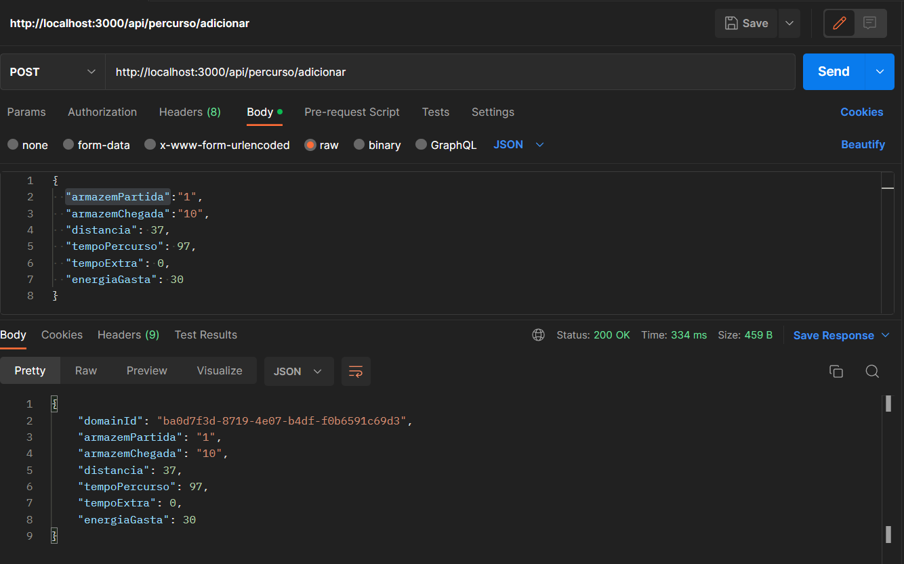
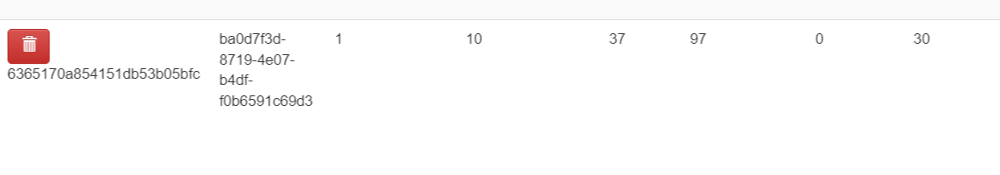
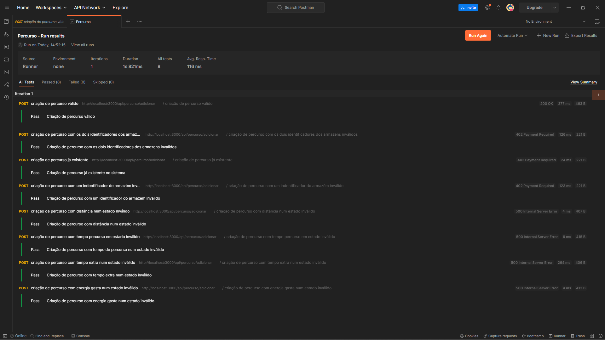

# US 10 - Como gestor de logística, pretendo criar um percurso.

A informação que a empresa possui sobre o percurso entre dois armazéns é a
seguinte:

- Identificação do armazém de partida
- Identificação do armazém de chegada
- Distância (em km)
- Tempo (em minutos) para percorrer a distância com o camião completamente cheio, ou seja, com a carga de 4,3 toneladas
- Energia gasta da bateria para percorrer essa distância com o camião completamente
  cheio (em kWh)
- Tempo extra se for necessário um carregamento extra da bateria (este dado é apenas
  diferente de 0 quando a carga das baterias a 80% feita previamente não é suficiente para percorrer completamente o troço, como por exemplo para um camião que carrega 4,3
  toneladas e que tem de ir da Póvoa do Varzim para Arouca)

Por exemplo, o troço entre a Maia e Espinho com a distância de 31 km é percorrido pelo camião em 53 minutos quando o camião está completamente cheio e gasta 25 kWh de energia da bateria.

#### Nota:

- As validações dos atributos do percurso então efetuadas, depois de interpretadas as necessidades do cliente foram que os identificadores dos armazéns inseridos têm que estar registados no sistema e todos os outros atributos têm que ser obrigatóriamente um número não negativo.

## Execução da funcionalidade

| Path                | Descrição              |
| ------------------- | ---------------------- |
| /percurso/adicionar | Criação de um percurso |

## Demonstração da funcionalidade

Caso de Sucesso:

---

## Testes

- [x] Registo de um percurso válido
- [x] Registo de percurso com os dois identificadores dos armazens inválidos
- [x] Registo de percurso já existente
- [x] Registo de percurso com um indentificador do armazém inválido
- [x] Registo de percurso com distância num estado inválido
- [x] Registo de percurso com tempo de percurso num estado inválido
- [x] Registo de percurso com tempo extra num estado inválido
- [x] Registo de percurso com energia gasta num estado inválido

#### Nota:

- O Teste relativo à criação de um percurso válido no sistema, só passa se o percurso não existir na base de dados, logo depois da sua criação devemos de proceder à sua eliminação
- Os testes encontram-se no ficheiro AdicionarPercurso.json que está localizado na pasta TestesPostman.

## Desenvolvedor 🦸

- 1201386 – Rita Ariana Sobral
