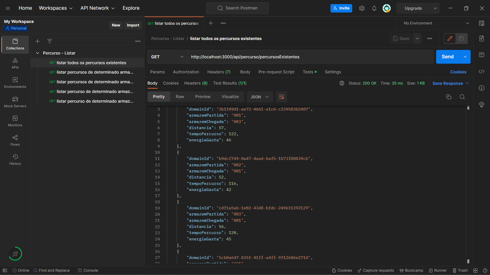
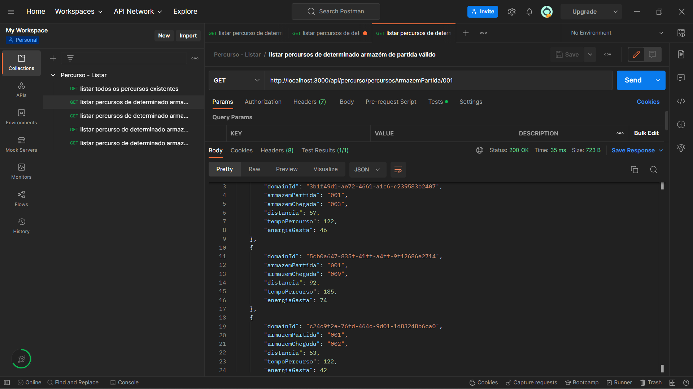
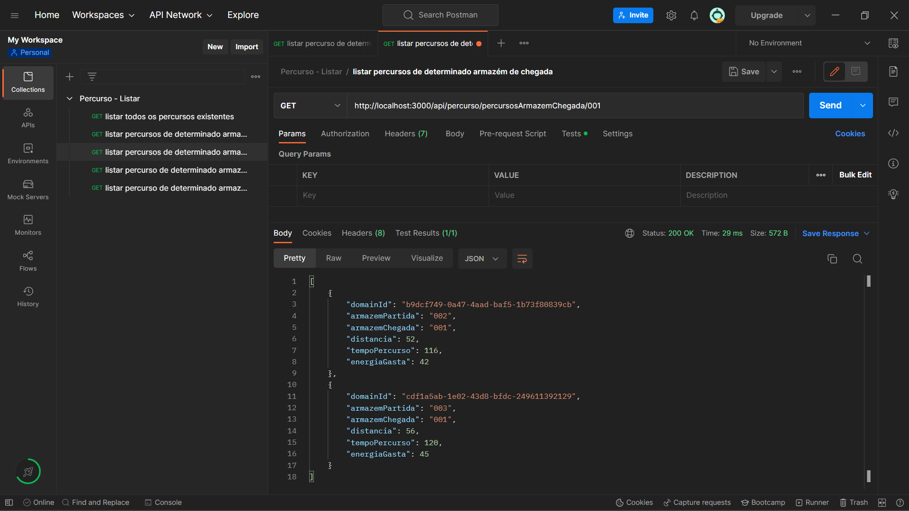
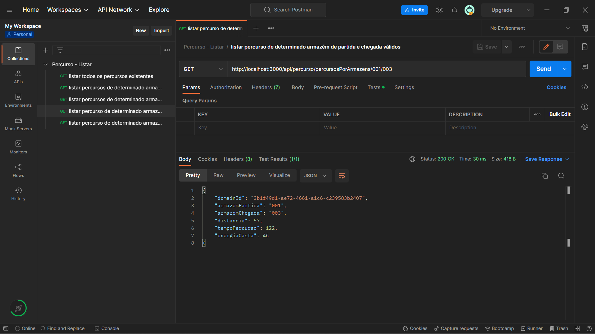
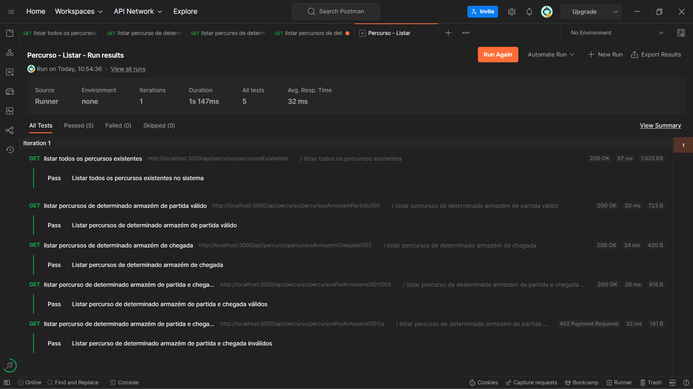

# US 11 - Como gestor de logística, pretendo listar os percursos.

- Depois de interpretadas as necessidades do cliente e o negócio, enquanto equipa decidimos que faria sentido existir 4 tipos de listagem:
    - Listar todos os percursos existentes no sistema
    - Listar todos os percursos para o armazém de partida indicado
    - Listar todos os percursos para o armazém de chegada indicado
    - Listar o percursos correspondente caso exista no sistema

## Execução da funcionalidade  

| Path                                                   | Descrição                                                    |
| ------------------------------------------------------ | ------------------------------------------------------------ |
| /percurso/percursosExistentes                          | Listar todos os percursos existentes no sistema              |
| /percurso/percursosArmazemPartida/:idArmazem           | Listar todos os percursos para o armazém de partida indicado |
| /percurso/percursosArmazemChegada/:idArmazem           | Listar todos os percursos para o armazém de chegada indicado |
| /percurso/percursosPorArmazens/:idArmazemP/:idArmazemC | Listar o percursos correspondente caso exista no sistema     |

## Demonstração da funcionalidade 

- Listar todos os percursos existentes no sistema

- Listar todos os percursos para o armazém de partida indicado

- Listar todos os percursos para o armazém de chegada indicado

- Listar o percursos correspondente caso exista no sistema

## Testes

- [x] Listar todos os percursos existentes
- [x] Listar percursos de determinado armazém de partida válido
- [x] Listar percursos de determinado armazém de chegada válido
- [x] Listar percurso de determinado armazém de partida e chegada válidos
- [x] Listar percurso de determinado armazém de partida e chegada inválidos

- Os testes encontram-se no ficheiro ListarPercursos.json que está localizado na pasta TestesPostman.

## Desenvolvedor 🦸
* 1201386 – Rita Ariana Sobral  
