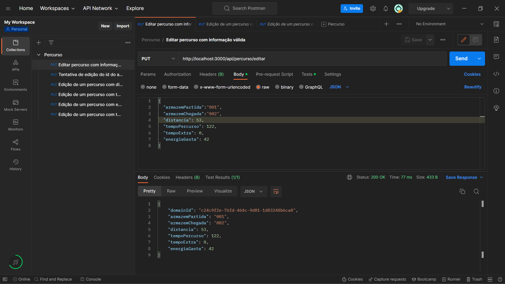
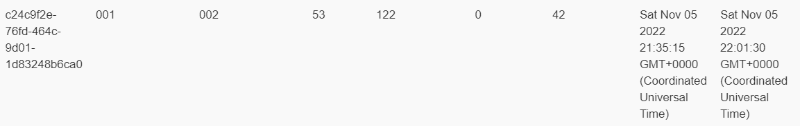
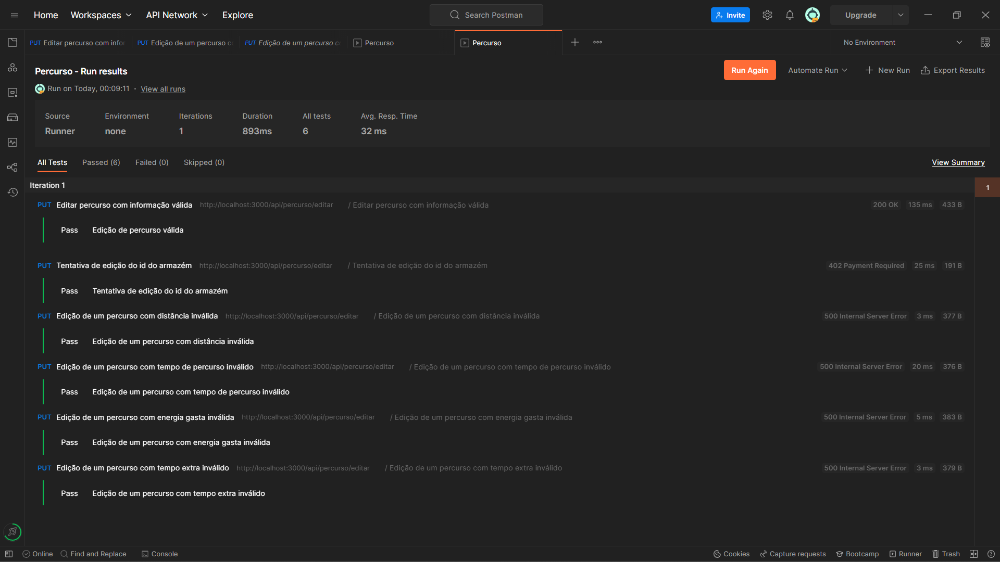

# US 12 - Como gestor de logística, pretendo editar um percurso.

- Depois de interpretadas as necessidades do cliente e o negócio, enquanto equipa decidimos que não faria sentido ser possível alterar os identificadores dos armazéns, pois de outra forma estariamos a falar de outro percurso. Todos os outros atributos, excetuando os identificadores do percurso, são possíveis de serem alterados. 

## Execução da funcionalidade 

| Path                | Descrição              |
| ------------------- | ---------------------- |
| /percurso/editar    | Edição de um percurso  |

## Demonstração da funcionalidade 

Caso de Sucesso: 

---

Nesta imagem conseguimos perceber que realmente foi efetuada uma edição do percurso indicado, pois a data de criação e a data de última edição do mesmo são diferentes.

## Testes

- [x] Edição de um percurso válido 
- [x] Tentativa de edição do id do armazém
- [x] Edição de um percurso com distância inválida
- [x] Edição de um percurso com tempo de percurso inválido
- [x] Edição de um percurso com tempo extra inválido
- [x] Edição de um percurso com energia gasta inválido

- Os testes encontram-se no ficheiro EditarPercurso.json que está localizado na pasta TestesPostman.

## Desenvolvedor 🦸
* 1201386 – Rita Ariana Sobral  
