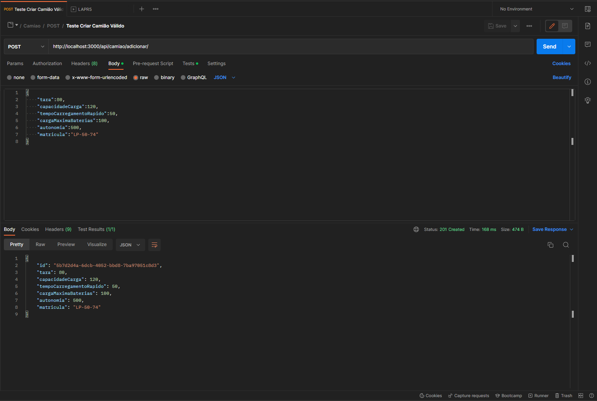
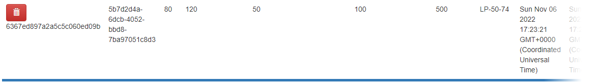

# US 7 - Como gestor de frota, pretendo criar um camião.

Os camiões elétricos têm as seguintes caraterísticas:

• Tara (peso do camião sem carga, ou seja, vazio): ex., 7,5 toneladas
• Capacidade de Carga (a massa que pode ser transportada no camião): ex., 4,3 toneladas
• Carga máxima do conjunto de baterias elétricas do camião (energia acumulada nas
baterias): ex., 80 kWh (quilo watt hora)
• Autonomia do camião com toda a capacidade de carga (ex., 4,3 toneladas) e com as
baterias elétricas completamente carregadas: ex., 100 km
• Tempo de carregamento rápido das baterias do camião (para carregar as baterias desde
o mínimo de carga elétrica recomendado, 20%, até um valor padrão de 80%): ex., 1 hora

#### Nota:

- As validações dos atributos do camião então efetuadas, depois de interpretadas as necessidades do cliente foram que a matrícula tem de ser única e todos os outros atributos têm que ser obrigatóriamente um número não negativo.

## Execução da funcionalidade

| Path              | Descrição            |
| ----------------- | -------------------- |
| /camiao/adicionar | Criação de um camiao |

## Demonstração da funcionalidade

Caso de Sucesso:

---

## Testes

- [x] Registo de um camião válido
- [x] Registo de um camião já existente
- [x] Registo de um camião com uma tara inválida
- [x] Registo de um camião com uma capacidade de carga inválida
- [x] Registo de um camião com tempo de carregamento rápido inválido
- [x] Registo de um camião com carga máxima das baterias inválida
- [x] Registo de um camião com autonomia inválida
- [x] Registo de um camião com matrícula inválida

#### Nota:

- O teste relativo à criação de um camião válido no sistema, só passa se o camião não existir na base de dados, logo depois da sua criação devemos de proceder à sua eliminação
- Os testes encontram-se no ficheiro CRUDCamiao.json que está localizado na pasta TestesPostman.

## Desenvolvedor 🦸

- 1200625 – Sérgio Lopes
