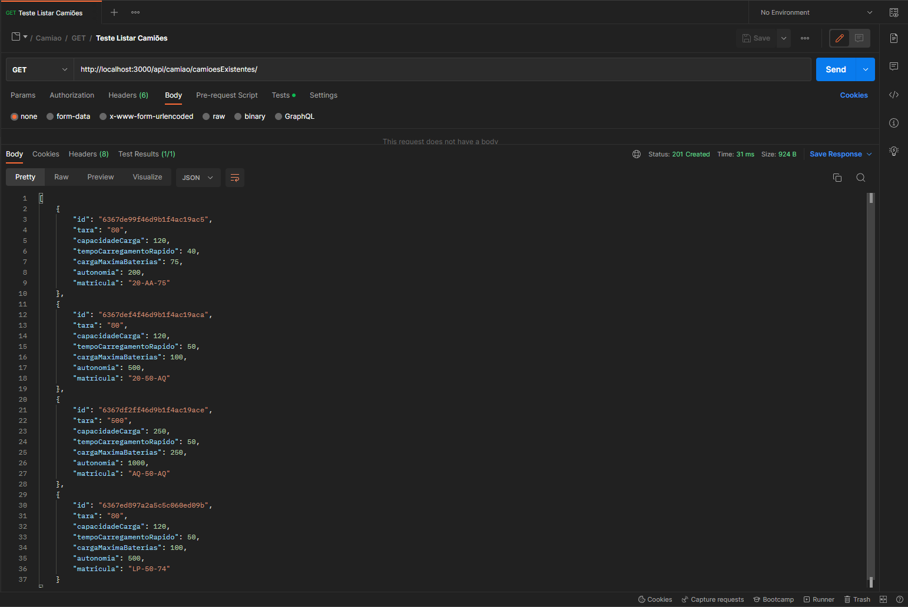
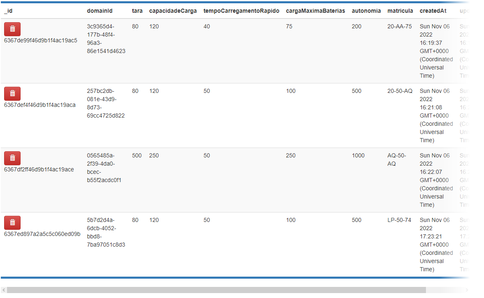

# US 8 - Como gestor de frota, pretendo listar os camiões.

- Depois de interpretadas as necessidades do cliente e o negócio, enquanto equipa decidimos que faria sentido existir apenas tipo de listagem:
  - Listar todos os camiões existentes no sistema

## Execução da funcionalidade

| Path                      | Descrição                                     |
| ------------------------- | --------------------------------------------- |
| /camiao/camioesExistentes | Listar todos os camiões existentes no sistema |

## Demonstração da funcionalidade

- Listar todos os camiões existentes no sistema
  

- Listar todos os camiões existentes na base de dados
  

## Testes

- [x] Listar todos os camões existentes

- Os testes encontram-se no ficheiro CRUDCamiao.json que está localizado na pasta TestesPostman.

## Desenvolvedor 🦸

- 1200625 – Sérgio Lopes
