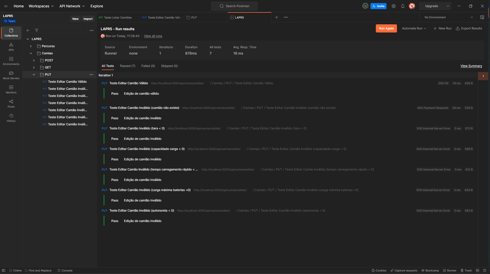

# US9 - Como gestor de frota, pretendo editar um camião.

- Depois de interpretadas as necessidades do cliente e o negócio, enquanto equipa decidimos que não faria sentido ser possível alterar a matrícula, pois a matrícula do camião nunca poderá ser alterada. Todos os outros atributos, excetuando a matrícula do camião, são possíveis de serem alterados.

#### Nota:

- As validações dos atributos do camião são então efetuadas, visto só ser possível guardar na base de dados camiões com os atributos positivos (exceto a matrícula que permanece intacta).

## Execução da funcionalidade

| Path           | Descrição           |
| -------------- | ------------------- |
| /camiao/editar | Edição de um camião |

## Demonstração da funcionalidade

Caso de Sucesso:

---

Nesta imagem conseguimos perceber que realmente foi efetuada uma edição do camião indicado, pois os atributos que desejamos alterar ficam devidamente atualizados na base de dados.

## Testes

- [x] Edição de um camiao válido
- [x] Edição de um camião com a matrícula inválida (camião que não existe)
- [x] Edição de um camião com a tara inválida
- [x] Edição de um camião com a capacidade de carga inválida
- [x] Edição de um camião com o tempo de carregamento rápido inválido
- [x] Edição de um camião com a carga máxima das baterias inválida
- [x] Edição de um camião com a autonomia inválida

- Os testes encontram-se no ficheiro CRUDCamiao.json que está localizado na pasta TestesPostman.

## Desenvolvedor 🦸

- 1200625 – Sérgio Lopes
